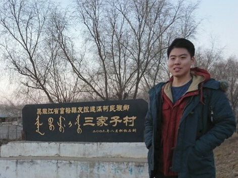

I am a third year Linguistics Ph.D. student at the [University of Chicago](https://linguistics.uchicago.edu). I am interested in analyzing morphosyntactic changes in Korean, Manchu-Tungusic, and Mongolic languages and documenting them through field methods.
Currently, I am working on the historical ordering of Korean morphemes in the predicate morphology from the generative point of view and the insubordination of Korean nominalized clauses from the comparative point of view with neighboring Manchu-Tungusic and Mongolic languages.

|  |
|:--:|
| In Sanjiazi (a.k.a. Ilan Boo), the village where the last Manchu speakers lived (Oct 2018)|

Before starting the Ph.D. program at the University of Chicago, I completed my B.A. in linguistics and anthropology and M.A. in linguistics at Seoul National University. I have worked on Uilta (Manchu-Tungusic), Manchu (Manchu-Tungusic), and the Southwestern Korean dialect (Jeollabuk-do), which is my native language. I also translated The Little Prince into the Southwestern dialect of Korean as part of an attempt to revitalize it.

# Updates
* August 23, 2024: I am going to present a section of my first qualifying paper under the same title, 'The Obligatoriness and Optionality in Korean Subject Honorification [(Abstract)](../files/WAFL18_abstract.pdf)' at [SICOGG26/WAFL18](https://sites.google.com/view/sicoggwafl2024/program?authuser=0).
* May 15, 2024: I defended my first qualifying paper '[The Obligatoriness and Optionality in Korean Subject Honorification](../files/Shim_QP1_20240515.pdf).'
* September 27, 2023: I presented my poster '[A Distributed Morphological approach to historical difference in the sequence of Korean suffix *-si*](../files/WAFL17_shim_poster_revised.pdf) [(Abstract)](https://drive.google.com/file/d/1irom1P9DaLLyCB75sZUn817MM8DuUFrn/view?usp=drive_link)' at [WAFL 17](http://visualizingcultures.mit.edu/wafl17/program.html), hosted by the Institute of Mongolian Studies. 
* July 22, 2023: I presented my research '[A comparative study of the Korean nominalizer *-(u)m* and the participle categories in Altaic languages as matrix predicates](../files/Shim_SIAC2023_abstract.pdf)' at [SIAC 2023](http://hosting01.snu.ac.kr/~altai/askv001/?module=file&act=procFileDownload&file_srl=7443&sid=746f32387efa1617dbea0f020e067a03), hosted by the Altaic Society of Korea.