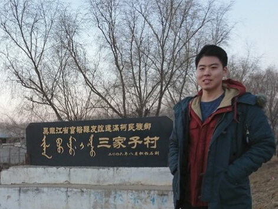

I am a fourth year Linguistics Ph.D. student at the [University of Chicago](https://linguistics.uchicago.edu). I am interested in analyzing morphosyntactic changes in Korean, Manchu-Tungusic, and Mongolic languages.

This academic year, I am primarily focusing on my dissertation proposal, which investigates the morphosyntactic changes from Middle Korean (ca. 10th–16th century) to Modern Korean (beginning in the 17th century), situating the analysis within the framework of generative syntax.

In the past years, I also worked on the verb raising in Khalkha Mongolian using experimental methods and the insubordination of Korean nominalized clauses from the comparative point of view with neighboring Manchu-Tungusic and Mongolic languages. 

|  |
|:--:|
| In Sanjiazi (a.k.a. Ilan Boo), the village where the last Manchu speakers lived (Oct 2018)|

Before starting the Ph.D. program at the University of Chicago, I completed my B.A. in linguistics and anthropology and M.A. in linguistics at Seoul National University. I have worked on Uilta (Manchu-Tungusic), Manchu (Manchu-Tungusic), and the Southwestern Korean dialect (Jeollabuk-do), which is my native language. I also translated The Little Prince into the Southwestern dialect of Korean as part of an attempt to revitalize it.

# Updates
* May 1, 2026: I will present a poster under the title '[When Grammaticalization Causes Trouble: The Case of Korean TAM marker *-te*,](../files/BMW-poster_final.pdf) at [Boston Morphology Workshop](https://sites.google.com/view/bostonmorphologyworkshop/). 
* December 6, 2025: I presented a presentation with the title '주체 존대 선어말어미 '-(으)시-'의 분포 변화에 대하여: 생성 문법적 접근 (On the Diachronic Change in the Distribution of the Korean Subject Honorific Suffix <i>(u)si</i>: from the Perspective of Generative Grammar, [abstract](../files/LSK25_abstract_ko.pdf), [abstract in English](../files/LSK25_abstract_en.pdf), [slides](../files/LSK2025_slides.pdf))' at the Linguistic Society of Korea 2025 Winter Conference [(Program)](../files/lsk25program.png).
* June 15, 2025: I will present a section of my first qualifying paper under the title, 'On the locality condition for Korean subject honorific suppletion [(Abstract)](../files/Shim_JK32abstract_revised.pdf), [(slides)](../files/JKslides_revised.pdf)' at [the 32nd Japanese/Korean Linguistics Conference](https://sites.google.com/view/jkconference32/home).
* May 15, 2025: I defended my second qualifying paper '[Is There String-Vacuous Verb Raising in Khalkha Mongolian? -- An Experimental Investigation](../files/QPDraft_20250504.pdf) (Committee: [Ming Xiang](https://linguistics.uchicago.edu/people/ming-xiang) and [Erik Zyman](https://linguistics.uchicago.edu/people/erik-zyman)).'