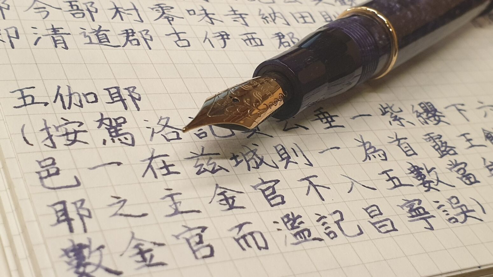

|  |
|:--:|
| My handwriting copying a part of *Samguk yusa* |

Here's some stuff that I love other than linguistics. 
* Animals
* Fountain pens
* Beautiful handwritings
* Coffees
* Songs sung in languages that I like the sounds (e.g., Cantonese, French, Greenlandic, Icelandic, Mongolian, Swedish, Tuvan, etc.)
    * If you know some nice songs that aren't sung in English or Korean, please do let me know!
* Cooking
* Playing the guitar
* Wines, Beers, Korean rice wines, etc.