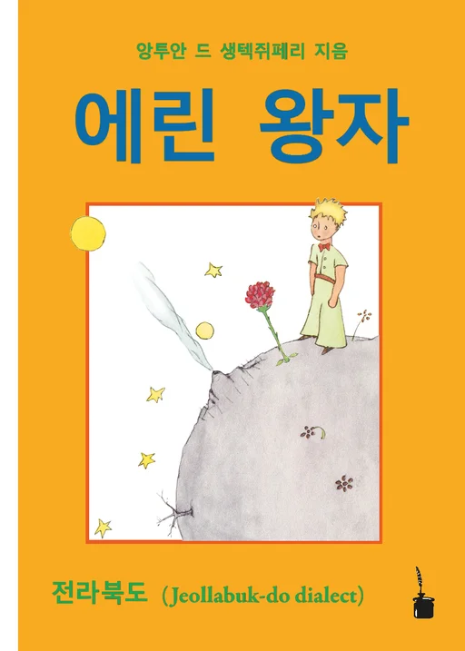



* Syntax, Morphosyntax
* Historical linguistics
  * Diachronic morphosyntax
  * Insubordination
  * Grammaticalization
* Korean Linguistics
* Altaic languages
  * Manchu-Tungusic
  * Mongolic
  * Turkic
* Language documentation and fieldwork
* Linguistic typology

# Publications
## 2021
**Shim, Jaehong**. [A study of the influence of Mandarin Chinese on Spoken Manchu](../files/Shim2021_AltaiHakpo.pdf). *Altai Hakpo* 31. 85-105. The Altaic Society of Korea.
# Language revitalization
## 2021
### *Eylin Wangca* (에린 왕자): The Little Prince in North Jeolla dialect

Antoine de Saint-Éxupery. [*Eylin Wangca*](https://editiontintenfass.de/en/catalog/374_der-kleine-prinz-koreanischer-dialekt) [*The Little Prince*]. Neckarsteinach: Edition Tintenfass. ISBN 978-3-947994-88-5. (Translated into North Jeolla dialect of Korean by **Jaehong Shim**)

